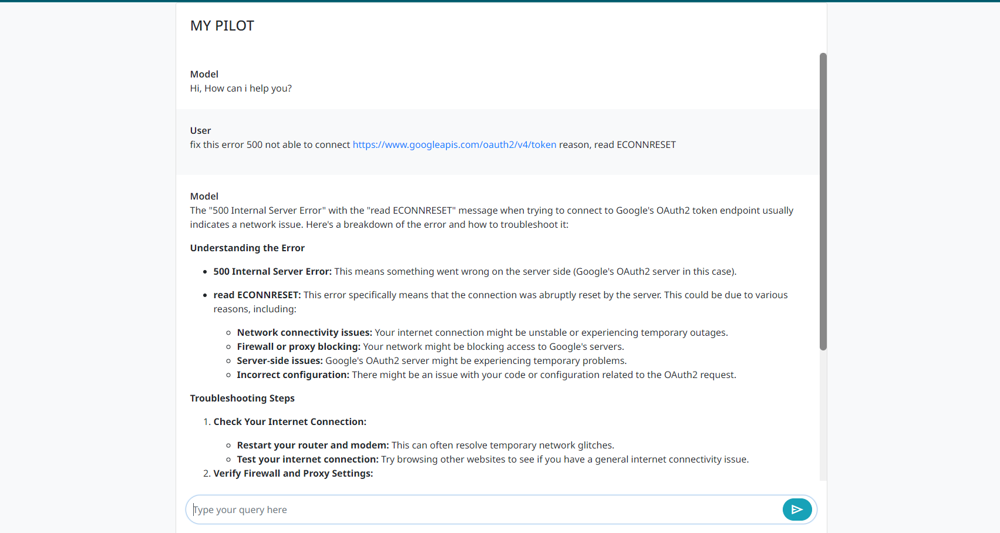
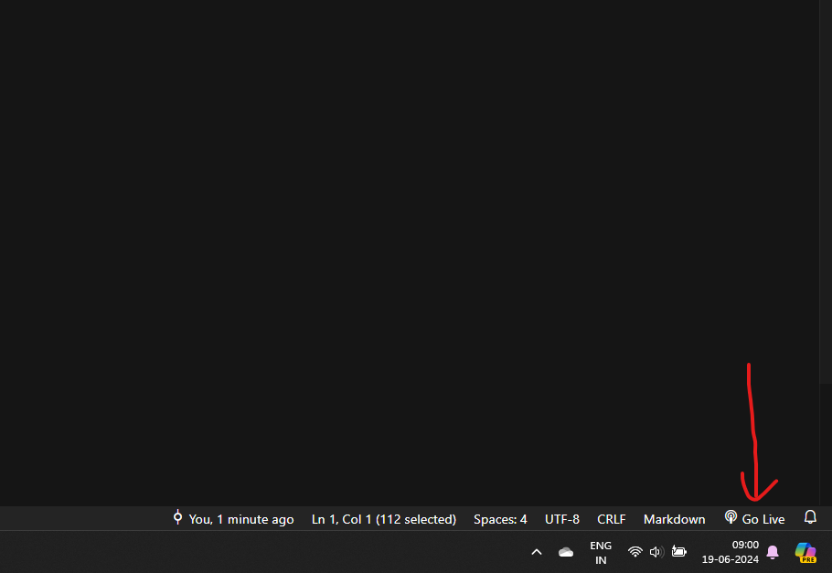

# my pilot

#### Update the API-KEY from here 
[api-key](https://aistudio.google.com/app/apikey)

`const API_KEY = "<API-KEY>";`

Just open your code in vs-code and run it go-live

[Live Server](https://marketplace.visualstudio.com/items?itemName=ritwickdey.LiveServer)

 